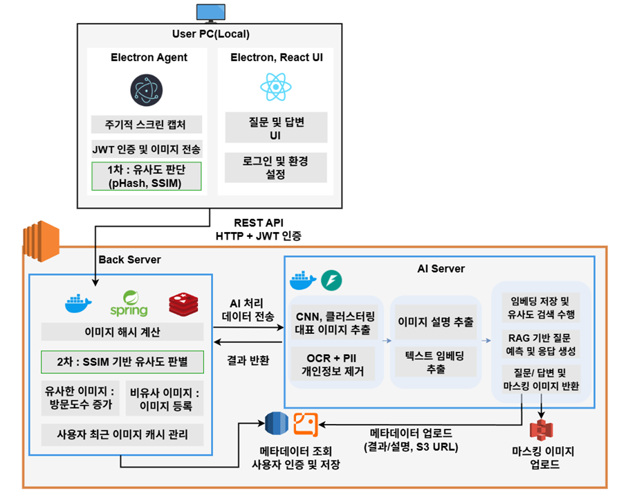

# MindTrack – Full System



> **MindTrack** 은 화면 캡처 → 이미지 샘플링/캐싱 → AI 분석 → 실시간 질문/답변 제공까지 이어지는 **엔드투엔드 작업 보조 시스템**입니다.  
> 프론트엔드(Electron), 백엔드(Spring Boot), AI 서버(FastAPI)로 구성되어 있으며, PostgreSQL·Redis·OpenAI API 등을 통합적으로 활용합니다.

---

## 📚 목차
- [📌 프로젝트 개요](#-프로젝트-개요)
- [🖼 아키텍처 개요](#-아키텍처-개요)
- [📂 레포지토리 구성](#-레포지토리-구성)
- [⚙️ 실행 흐름](#️-실행-흐름)
- [🔗 세부 문서 링크](#-세부-문서-링크)
- [🚀 실행 방법](#-실행-방법)

---

## 📌 프로젝트 개요
- **Frontend (Electron + React)**  
  - 사용자 로그인/회원가입  
  - 화면 캡처 시작/중지  
  - 프론트 1차 SSIM 필터 → 백엔드 업로드  
  - SSE 구독 → 질문/답변 UI 표시  

- **Backend (Spring Boot)**  
  - JWT 인증  
  - 스크린샷 샘플링 (dHash/SSIM, Redis 캐시)
  - Postgres LISTEN/NOTIFY + SSE publish

- **AI Server (FastAPI)**  
  - 이미지 업로드 파이프라인  
  - OCR + PII 마스킹  
  - 이미지 설명 생성(OpenAI)  
  - Embedding + 벡터DB 검색  
  - 행동/질문 예측 및 QA 응답
  - 분석 결과 DB 저장

---

## 🖼 아키텍처 개요

```mermaid
flowchart TB

  R[Renderer - React]
  P[Preload - contextBridge]
  M[Main - Electron]
  BE[Backend - Spring Boot]
  AI[AI Server - FastAPI]
  DB[(Postgres)]
  REDIS[(Redis)]

  R -->|window.auth / window.api / window.capture| P
  P -->|IPC - ipcRenderer| M

  M -->|HTTP-upload + JWT| BE
  M -->|SSE - EventSource| BE

  BE -->|cache| REDIS
  BE -->|store| DB
  BE -->|call| AI
  AI -->|insert| DB
  DB -->|notify| BE

  BE -->|publish| M
  M -->|IPC - suggestions / heartbeat  / error| R
```
---

## 📂 레포지토리 구성

- **[mindtrack-frontend](https://github.com/4-nyang-dan/mindtrack-front)**  
  Electron + React 기반 UI  
  - 로그인/회원가입, 화면 캡처, SSE UI 표시  
  - 프론트에서 1차 SSIM 필터링

- **[mindtrack-backend](https://github.com/4-nyang-dan/mindtrack-backend)**  
  Spring Boot 기반 API 서버  
  - JWT 인증  
  - 스크린샷 샘플링(dHash/SSIM) + Redis 캐시  
  - Postgres NOTIFY + SSE Hub  

- **[mindtrack-ai](https://github.com/4-nyang-dan/mindtrack-ai)**  
  FastAPI 기반 AI 분석 서버  
  - OCR + PII 마스킹  
  - 이미지 설명, Embedding 저장/검색  
  - 행동/질문 예측 및 QA  

---

## ⚙️ 실행 흐름

1. **Frontend**
   - 사용자가 로그인 후 캡처 시작
   - 프론트에서 1차 SSIM 필터링 → 변화가 큰 이미지만 업로드

2. **Backend**
   - 업로드 이미지 샘플링(dHash/SSIM)
   - Redis 캐시 관리, DB 저장
   - 분석 대기 상태(PENDING) → AI 서버 요청

3. **AI Server**
   - OCR/PII, 이미지 설명, Embedding, 행동/질문 예측
   - 결과 DB 저장 → Postgres NOTIFY 발행

4. **Backend → Frontend**
   - PgSuggestionsListener → SSE Hub → SSE publish
   - Electron Main → Renderer → UI 표시

---

## 🔗 세부 문서 링크
- [Frontend README]
- [Backend README]
- [AI Server README]
  
[Frontend README]: https://github.com/4-nyang-dan/mindtrack-front#readme
[Backend README]:  https://github.com/4-nyang-dan/mindtrack-backend#readme
[AI Server README]: https://github.com/4-nyang-dan/mindtrack-ai#readme

---

## 🚀 실행 방법

> 이 프로젝트는 **루트 폴더**에서 AI 서버(FastAPI), Backend(Spring Boot), Redis, Postgres를 **Docker Compose**로 띄우고, **Frontend(Electron)** 는 로컬에서 실행합니다.
> Mindtrack_V1은 도커 + 로컬 환경으로, 추후 원격 서버 + 도커 및 pc 설치 응용 프로그램 .exe로 제공되는 점 양해 부탁드립니다.

### 0) 폴더 구성 (최종 목표)

```
mindtrack/
├─ mindtrack-ai/                 # mindtrack-ai (별도 리포 clone)
├─ mindtrack-backend/            # mindtrack-backend (별도 리포 clone)
├─ docker-compose.yml  # 루트 docker-compose (로컬에서 생성)
└─ .env                # 루트 환경파일 (로컬에서 생성)
```

---

### 1) 리포지토리/프로젝트 준비

1) 루트 폴더 생성  
2) 루트 안에 **AI**와 **Backend** 각각 clone
~~~bash
# 예시
mkdir mindtrack && cd mindtrack
git clone <ai-repo-url> ai
git clone <backend-repo-url> backend
~~~

3) **템플릿 복사 → 실제 파일 생성**  
- 레포에는 `docker-compose.example.yml`, `.env.example`(루트용), `ai/.env.example`(AI용)를 올려두세요.  
- 사용자는 아래처럼 복사해서 **개인 값**을 채웁니다.
~~~bash
cp docker-compose.example.yml docker-compose.yml
cp .env.example .env
cp ai/.env.example ai/.env
~~~

---

### 2) 루트 `.env` 템플릿 (복사 후 값 채우기)

~~~dotenv
# ── 공용 인프라 ──────────────────────────────
POSTGRES_HOST=postgres
POSTGRES_PORT=5432
POSTGRES_DB=mindtrack
POSTGRES_USER=mindtrack
POSTGRES_PASSWORD=super-secure-password

REDIS_HOST=redis
REDIS_PORT=6379

# ── 백엔드 환경 (스프링에서 참조) ─────────────
# application.properties에서 ${...}로 사용
SPRING_JWT_SECRET=secret-jwt-secret
SPRING_JWT_EXP_MS=3600000
~~~

---

### 3) AI용 `ai/.env` 템플릿 (복사 후 값 채우기)

~~~dotenv
# OpenAI
APP_HOST=0.0.0.0
APP_PORT=8000
APP_ENV=development

OPENAI_API_KEY=sk-****************************************

# OCR / PII (예: 시스템 경로 환경)
TESSERACT_PATH=/usr/bin/tesseract

# 벡터DB/파이프라인 파라미터 (필요 시)
VSTORE_PATH=faiss
VECTOR_DB_PATH=./vectorstore/vector_index.faiss

LOG_LEVEL=INFO
~~~

---

### 4) 루트 `docker-compose.yml` 템플릿

> 백엔드와 AI는 **로컬 clone 디렉토리(./backend, ./ai)** 를 **build context** 로 사용합니다.

~~~yaml
services:
  postgres:
    image: postgres:15
    container_name: mindtrack_postgres
    restart: always
    ports: ["5432:5432"]
    env_file:
      - ./.env
    environment:
      POSTGRES_USER: ${POSTGRES_USER}
      POSTGRES_PASSWORD: ${POSTGRES_PASSWORD}
      POSTGRES_DB: ${POSTGRES_DB}
    volumes:
      - pgdata:/var/lib/postgresql/data
    networks: [mindtrack_net]
    healthcheck:
      test: ["CMD-SHELL", "pg_isready -U 4nyangdan -d mindtrack"]
      interval: 10s
      timeout: 5s
      retries: 5

  redis:
    image: redis:7
    container_name: mindtrack_redis
    restart: always
    ports: ["6379:6379"]
    networks: [mindtrack_net]
    healthcheck:
      test: ["CMD", "redis-cli", "ping"]
      interval: 5s
      timeout: 3s
      retries: 5

  spring-backend:
    build: ./mindtrack-backend
    container_name: mindtrack_spring
    ports: ["8080:8080"]
    depends_on:
      postgres:
        condition: service_healthy
      redis:
        condition: service_healthy
    env_file:
      - ./.env
    environment:
      SPRING_DATASOURCE_URL: jdbc:postgresql://${POSTGRES_HOST}:${POSTGRES_PORT}/${POSTGRES_DB}
      SPRING_DATASOURCE_USERNAME: ${POSTGRES_USER}
      SPRING_DATASOURCE_PASSWORD: ${POSTGRES_PASSWORD}
      SPRING_DATA_REDIS_HOST: ${REDIS_HOST}
      SPRING_DATA_REDIS_PORT: ${REDIS_PORT}
      AUTH_JWT_SECRET: ${SPRING_JWT_SECRET}
      AUTH_JWT_EXP_MS: ${SPRING_JWT_EXP_MS}
    healthcheck:
      test: ["CMD", "curl", "-f", "http://localhost:8080/actuator/health"]
      interval: 10s
      timeout: 5s
      retries: 5
    networks: [mindtrack_net]

  fastapi-ai:
    build: ./mindtrack-ai
    container_name: mindtrack_ai
    ports: ["8000:8000"]
    depends_on:
      postgres:
        condition: service_healthy
      redis:
        condition: service_healthy
    env_file:
      - ./.env
    networks: [mindtrack_net]

volumes:
  pgdata:

networks:
  mindtrack_net:
    driver: bridge
~~~

---

### 5) 컨테이너 기동

~~~bash
# 루트 디렉토리에서
docker compose up --build
# 또는 (Docker Compose v1)
# docker-compose up --build
~~~

> 성공하면:  
> - 백엔드: http://localhost:${BACKEND_PORT} (기본 8080)  
> - AI: http://localhost:${AI_PORT} (기본 8000)  
> - Redis: localhost:6379, Postgres: localhost:5432

---

### 6) 프론트엔드 실행 (별도 clone)

1) 프론트 프로젝트 clone → 의존성 설치  
2) 타입스크립트 메인 빌드(선택) → 개발 서버 + 일렉트론 실행

~~~bash
# 프론트 폴더에서
npm install
npm run build-main   # (선택) main.ts → main.js 트랜스파일

# Windows (cmd)
set BROWSER=none&& npm start
# Windows (PowerShell)
$env:BROWSER="none"; npm start
# macOS/Linux
BROWSER=none npm start

# React 개발 서버가 뜬 뒤
npx electron .
~~~

> Electron 앱이 뜨면 **로그인 → 캡처 시작** 후, 실시간 Q/A UI가 나타납니다.

---
